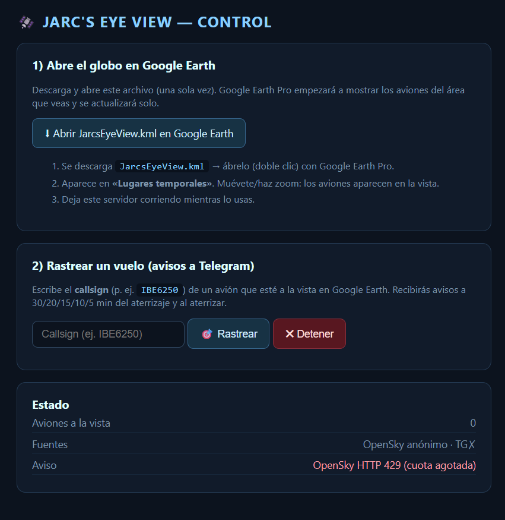

# JARC's EYE View — Rastreador de vuelos en vivo

Panel de monitoreo en tiempo real sobre un globo 3D fotorrealista
(**CesiumJS + Google Photorealistic 3D Tiles**), con backend en **Python (FastAPI)**
que empuja datos por **WebSocket**.

```
OpenSky (ADS-B) ─┐
adsbdb (rutas)  ─┤→ FastAPI (WebSocket) → Navegador (CesiumJS + Google 3D Tiles)
Telegram (avisos)┘
```

## Captura

**Panel de control** (rastreo de vuelos y enlace a Google Earth):



## Funcionalidades

- **Aviones en vivo** de la zona que estás viendo (OpenSky Network).
- **#1 Estelas + movimiento fluido**: cada avión se interpola entre consultas
  (dead-reckoning) y deja una estela; se ve como un radar, no a saltos.
- **#2 Filtros**: por país, aerolínea/callsign, altitud mínima, solo emergencias,
  y toggle de estelas.
- **#3 Alertas de emergencia**: squawk 7500/7600/7700 → aviso a Telegram + avión en rojo.
- **#4 Origen → destino** de cada vuelo (adsbdb) al seleccionarlo.
- **Rastreo de un vuelo**: selecciona un avión → "Rastrear + Telegram".
  Recibes avisos a **30, 20, 15, 10 y 5 min** del aterrizaje y **al aterrizar**.
  Se dibuja el aeropuerto destino y una línea hacia él, con ETA en vivo.
- **Vuela a tu ubicación** al abrir (geolocalización del navegador, con respaldo por IP).
- **Scanner de radios** 📻: escanea emisoras de internet cercanas a la zona del mapa
  (Radio Browser), las muestra como marcadores y en una lista; clic → **reproduce** el stream.
- **Estado de vuelo** (AviationStack): terminal, gate, hora programada/real de aterrizaje
  y delays, en el panel de selección (botón «Horario / Gate») y en los avisos de Telegram.
- **Webcams en vivo** 📷 (Windy): escanea webcams cercanas a la zona del mapa, marcadores
  en el globo y lista; clic → reproductor en vivo incrustado + enlace a Windy.
  Incluye toggle **«🚦 Solo cámaras de tráfico»** (cámaras de carretera en vivo).
- **Búsqueda con pin + Street View**: al buscar un lugar cae un pin y un botón abre Street View.
- **Capas globales** (panel CAPAS): **aviones**, **terremotos** en vivo (USGS), **ISS** con estela
  (wheretheiss.at), **radar de lluvia** (RainViewer), **barcos (AIS)** en vivo por WebSocket
  (AISStream, `AISSTREAM_KEY`) y **cámaras ALPR** (ubicaciones públicas de OpenStreetMap/DeFlock).
- **Dock de control** (barra inferior): **presets visuales** (Normal/CRT/NVG/FLIR/Anime/Noir/Snow),
  **fuentes de mapa** (Google 3D / Bing / ESRI / OSM) y **comandos de voz** con GPT.
- **Comandos de voz**: el navegador transcribe (Web Speech API) y GPT (backend, `OPENAI_API_KEY`)
  interpreta la orden en una acción: volar a un lugar, activar capas, cambiar preset/mapa,
  rastrear un vuelo, Street View, etc. La API key vive solo en el backend.
- **Paneles plegables**: clic en el encabezado de cada panel de la izquierda para contraer/expandir.
- **Modo OBJETIVO** (spy zoom): arrastra un recuadro y hace un zoom cinematográfico estilo satélite,
  con HUD de datos en vivo (lat/lon/área/elevación/dirección real), viewfinder de cámara con
  glitch/TV-flicker, autofocus, reticle anclado al punto y efecto "enhance".
- **Live Environment** (IA): al acercarte a <100 ft (o desde el dock) captura la vista y GPT-4o
  la analiza (edificio, techos, HVAC, vehículos, estructura) en un modal estilo inteligencia,
  con animación de "satélite recibiendo feed" y generación de vistas con gpt-image-1.
- **TomTom** (`TOMTOM_KEY`, proxied): **tráfico en vivo**, **nombres de calles** y **direcciones
  reales** (reverse-geocode) en el HUD. Fuentes de mapa extra: **Google Normal** (2D) y **Street View**.

## 1. Requisitos

- Python 3.11+ (probado con 3.14)
- **API key de Google Maps Platform** con la **Map Tiles API** habilitada.
- (Opcional pero recomendado) cuenta OpenSky para más cuota.
- (Opcional) bot de Telegram para las notificaciones.

## 2. Instalación

```powershell
cd D:\jarceye
py -m venv .venv
.\.venv\Scripts\Activate.ps1
pip install -r backend/requirements.txt
copy .env.example .env      # edita .env con tus claves
```

## 3. Ejecutar

```powershell
py -m uvicorn backend.main:app --reload --port 8000
```

Hay **dos formas** de ver el globo:

### Opción A — Google Earth Pro (escritorio) ⭐ recomendada si lo tienes instalado

1. Abre el **panel de control**: <http://localhost:8000/panel>
2. Pulsa **«Abrir JarcsEyeView.kml en Google Earth»** (descarga <code>JarcsEyeView.kml</code>).
3. Ábrelo con Google Earth Pro (doble clic). Aparece en *Lugares temporales*.
4. Muévete/haz zoom: Google Earth le pide al servidor los aviones del **área que ves**
   y se refresca solo cada pocos segundos (por `NetworkLink`).
5. Para **rastrear un vuelo**: en el panel escribe su *callsign* y pulsa «Rastrear».
   El avión y su ruta al aeropuerto destino se dibujan en Google Earth, y llegan los
   avisos a Telegram (30/20/15/10/5 min y aterrizaje).

Cómo funciona por dentro:
- `GET /earth.kml`  → archivo maestro con el `NetworkLink` (ábrelo una vez).
- `GET /flights.kml?BBOX=w,s,e,n` → KML dinámico; Google Earth añade el `BBOX` de tu vista.
- `GET /panel` + `POST /api/track` `/api/untrack` + `GET /api/status` → control del rastreo.

### Opción B — Navegador (CesiumJS + Google 3D Tiles)

Abre <http://localhost:8000>. Necesita `GOOGLE_MAPS_API_KEY`; sin ella arranca con el
globo base de Cesium. Toda la interacción (filtros, selección, rastreo) está en la web.

## 4. Configurar Telegram (para los avisos de vuelo)

1. En Telegram habla con **@BotFather** → `/newbot` → copia el **TOKEN**.
2. Envíale un mensaje a tu bot recién creado.
3. Abre `https://api.telegram.org/bot<TOKEN>/getUpdates` y copia el `chat.id`.
4. Pon `TELEGRAM_BOT_TOKEN` y `TELEGRAM_CHAT_ID` en `.env`.

Sin Telegram el rastreo funciona igual (verás el ETA en pantalla), solo que no
llegan los mensajes.

## 5. Cómo usarlo

1. Mueve/haz zoom: el backend consulta OpenSky **solo para el área visible**.
2. Clic en un avión → panel de **Selección** con datos y su **ruta**.
3. Botón **"Rastrear + Telegram"** → empiezan los avisos por umbrales.
4. Panel **Rastreo activo**: ruta, distancia, ETA y los umbrales que se van cumpliendo.
   Botón para detener.

## 6. Notas y límites

- **Cuota de OpenSky anónima es baja.** Si ves `⚠ OpenSky HTTP 429`, añade
  `OPENSKY_CLIENT_ID/SECRET` en `.env` (cuenta gratuita → app OAuth2).
- El **ETA es estimado** (distancia al destino ÷ velocidad); no modela patrones
  de aproximación ni esperas, pero es suficiente para los avisos.
- Las **rutas** vienen de adsbdb (comunitario): la mayoría de vuelos comerciales
  las tiene; algunos privados/militares no.

## 7. Arquitectura del código

- `backend/services.py` — clientes externos: `OpenSky`, `RouteService` (adsbdb),
  `Telegram`, y `haversine_km`.
- `backend/main.py` — FastAPI + WebSocket. Tareas `poller` (aviones del área) y
  `tracker` (seguimiento de un vuelo, ETA, umbrales y notificaciones).
- `frontend/index.html` — CesiumJS: render, interpolación, estelas, filtros,
  paneles de selección y rastreo.

Mensajes WebSocket documentados al inicio de `backend/main.py`.

## 8. Licencia

Distribuido bajo licencia **MIT**. Ver [`LICENSE`](LICENSE).

## Fuentes de datos

- Posiciones ADS-B: [OpenSky Network](https://opensky-network.org)
- Rutas de vuelo: [adsbdb](https://www.adsbdb.com)
- Globo 3D: [CesiumJS](https://cesium.com) · Google Photorealistic 3D Tiles · Google Earth Pro
